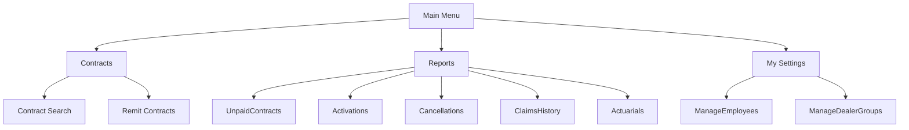

# ADL Automation – Business Overview

## Purpose

ADL Automation is an end-to-end test automation framework designed to validate and streamline business processes for the Protective ADL Portal. It automates user journeys, contract management, reporting, and user administration, ensuring quality and compliance across business operations.

This project has been **modernized from Selenium to Playwright** to leverage modern web automation capabilities, improved reliability, and enhanced testing features.

---

## Key Business Features

- **User Management**: Manage Dealers, Dealer Groups, Employees, Agents, and Lenders.
- **Contract Management**: Create, search, remit, and edit contracts.
- **Reporting**: Generate and export business reports (PDF, Excel) for contracts, activations, cancellations, claims, actuarials, and account statements.
- **Permissions & Roles**: Fine-grained access control for different user types (Admin, Dealer, Agent, Subagent, Lender, etc.).
- **Data Integration**: Automated validation with backend databases and external files (Excel, PDF).
- **UI Consistency**: Automated checks for branding, color, and layout compliance.

---

## High-Level Workflow

```mermaid
flowchart TD
    A[User Login] --> B{Role Selection}
    B -->|Dealer| C[Dealer Dashboard]
    B -->|Agent| D[Agent Dashboard]
    B -->|Admin| E[Admin Dashboard]
    C --> F[Contract Management]
    C --> G[Reports]
    D --> F
    D --> G
    E --> H[User Management]
    E --> G
    F --> I[Create/Search/Edit Contracts]
    G --> J[Export Reports (PDF/Excel)]
    H --> K[Manage Permissions]
    H --> L[Manage Dealer Groups/Employees]
```

---

## Technology Stack

### Modernized with Playwright

- **Framework**: Maven-based Java project
- **Automation**: Microsoft Playwright (replaced Selenium WebDriver)
- **Test Framework**: TestNG
- **Reporting**: Built-in Playwright trace viewer, video recording, screenshots
- **Data Handling**: Apache POI for Excel, PDFBox for PDF validation
- **Configuration**: Properties-based environment management
- **Logging**: SLF4J with Logback

### Key Advantages of Playwright Migration

- **Auto-wait**: Intelligent waiting for elements without explicit waits
- **Multiple browsers**: Chromium, Firefox, and WebKit support
- **Built-in debugging**: Trace viewer, video recording, screenshots
- **Network interception**: Mock APIs and validate network requests
- **Parallel execution**: Better parallel test execution support
- **Modern web features**: Support for shadow DOM, frames, and modern web apps

---

## Project Structure

```
adl-e2e-playwright/
├── src/
│   ├── main/
│   │   ├── java/com/adl/automation/
│   │   │   ├── core/           # Framework core classes
│   │   │   ├── pages/          # Page Object Model classes
│   │   │   └── utils/          # Utility classes
│   │   └── resources/
│   │       ├── config_dev.properties
│   │       └── config_prod.properties
│   └── test/
│       ├── java/com/adl/automation/tests/
│       └── resources/
│           ├── testng.xml
│           ├── testdata/       # Excel test data files
│           └── logback-test.xml
├── target/                     # Build outputs, reports
├── pom.xml                     # Maven dependencies
└── ProjectOverview.md         # This documentation
```

---

## Main Modules & Their Business Functions

### 1. User Management
- Add, edit, and manage users (Dealers, Agents, Employees, Lenders).
- Assign roles and permissions.
- Impersonate users for support and troubleshooting.

### 2. Contract Management
- Create new contracts and manage existing ones.
- Remit contracts to Protective.
- Edit, search, and filter contracts by various criteria (status, dealer, date, etc.).

### 3. Reporting
- Generate business-critical reports:
  - Unpaid Contracts
  - Activations
  - Cancellations
  - Claims History
  - Actuarials
  - Account Statements
- Export reports in PDF and Excel formats.

### 4. Permissions & Roles
- Assign and modify permissions for each user type.
- Control access to features and data based on business roles.

### 5. Data Integration & Validation
- Automated validation of data with backend databases.
- Read and write data from Excel files for test data and reporting.
- Validate generated PDF reports for accuracy.

---

## Example User Journeys

- **Dealer Employee** logs in, views dashboard, creates a contract, and exports a report.
- **Admin** manages user permissions, impersonates a dealer, and reviews account statements.
- **Business Analyst** reviews automated test reports to ensure business rules are enforced.

---

## Test Configuration

### Environment Configuration

The framework supports multiple environments through configuration files:
- `config_dev.properties` - Development environment
- `config_prod.properties` - Production environment

Set environment using system property: `-Denv=dev` or `-Denv=prod`

### Browser Configuration

Playwright supports multiple browsers:
- **Chromium** (default) - Chrome/Edge-like behavior
- **Firefox** - Mozilla Firefox
- **WebKit** - Safari-like behavior

Configure browser in properties: `browser.type=chromium|firefox|webkit`

### Parallel Execution

Tests can run in parallel using TestNG:
- Configure in `testng.xml`: `parallel="methods" thread-count="3"`
- Adjust thread count based on system resources

---

## Running Tests

### Prerequisites

1. Java 11 or higher
2. Maven 3.6 or higher
3. No need to install browsers (Playwright auto-installs)

### Commands

```bash
# Install Playwright browsers
mvn exec:java -e -D exec.mainClass=com.microsoft.playwright.CLI -D exec.args="install"

# Run all tests
mvn test

# Run tests in specific environment
mvn test -Denv=prod

# Run specific test class
mvn test -Dtest=LoginTests

# Run with custom browser
mvn test -Dbrowser.type=firefox

# Generate reports
mvn surefire-report:report
```

---

## Visual: Menu Structure (Sample)



---

## Automated Test Coverage

- **UI validation** (branding, layout, color)
- **Functional flows** (contract lifecycle, reporting, user management)
- **Data-driven tests** (Excel, database)
- **Permission and access control scenarios**
- **Cross-browser testing** (Chromium, Firefox, WebKit)
- **API testing** (network interception)
- **Visual regression testing** (screenshots)

---

## Reporting and Debugging

### Playwright Built-in Features

- **Trace Viewer**: Step-by-step test execution trace
- **Video Recording**: Full test execution videos
- **Screenshots**: Automatic failure screenshots
- **Network Logs**: All network requests/responses
- **Console Logs**: Browser console output

### Access Reports

```bash
# Open trace viewer
npx playwright show-trace target/traces/trace.zip

# View videos
open target/videos/

# View screenshots  
open target/screenshots/
```

---

## Business Value

- **Reduces manual testing effort** and human error.
- **Ensures compliance** with business rules and branding.
- **Provides rapid feedback** on business process changes.
- **Supports business users and analysts** with reliable, repeatable validation.
- **Improved reliability** with Playwright's auto-wait and retry mechanisms.
- **Better debugging capabilities** with built-in trace viewer and video recording.
- **Cross-browser compatibility** testing out of the box.

---

## Migration from Selenium

### Key Changes

1. **WebDriver → Playwright**: Replaced Selenium WebDriver with Playwright
2. **Auto-wait**: Removed explicit WebDriverWait, using Playwright's built-in waiting
3. **Locators**: Updated to use Playwright's locator API
4. **Browser Management**: Simplified browser lifecycle management
5. **Screenshots/Videos**: Built-in recording capabilities
6. **Dependencies**: Updated Maven dependencies from Selenium to Playwright

### Benefits Realized

- **Faster test execution** due to intelligent waiting
- **Reduced flakiness** with auto-retry and better element detection
- **Better debugging** with trace viewer and video recording
- **Modern web support** including shadow DOM and iframes
- **Multiple browser engines** without additional driver management

---

## Future Enhancements

- **API Testing**: Leverage Playwright's network interception for API validation
- **Visual Testing**: Implement visual regression testing with screenshots
- **Performance Testing**: Use Playwright's performance APIs
- **Mobile Testing**: Add mobile browser testing capabilities
- **CI/CD Integration**: Enhanced GitHub Actions workflow with Playwright

---

This modernized framework provides a solid foundation for reliable, maintainable, and scalable test automation for the ADL Portal business processes.